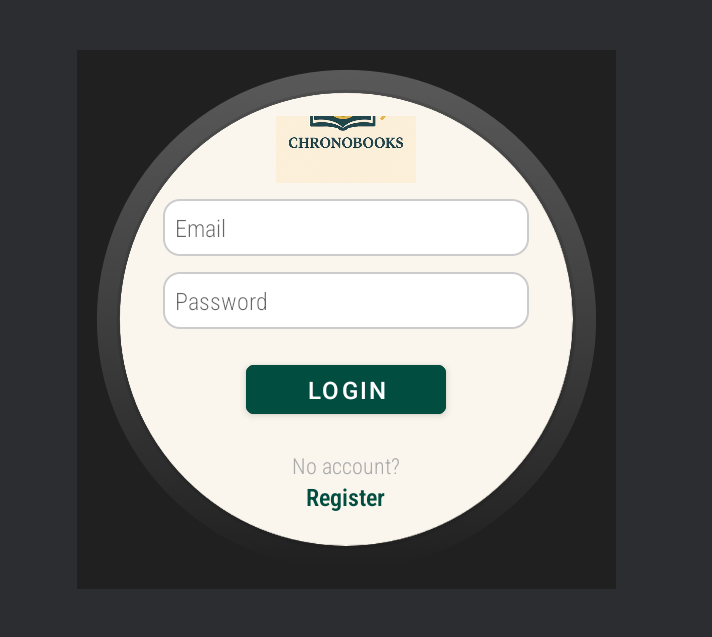
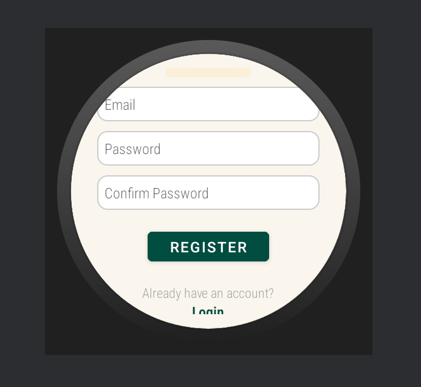
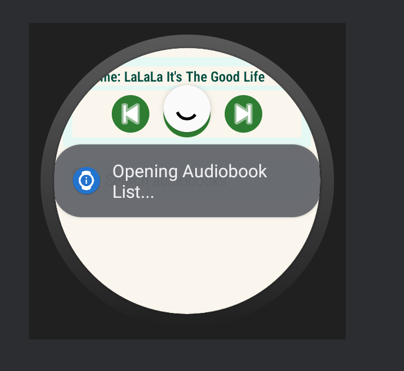
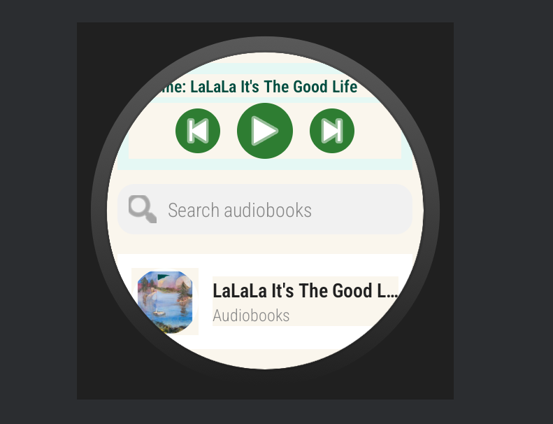
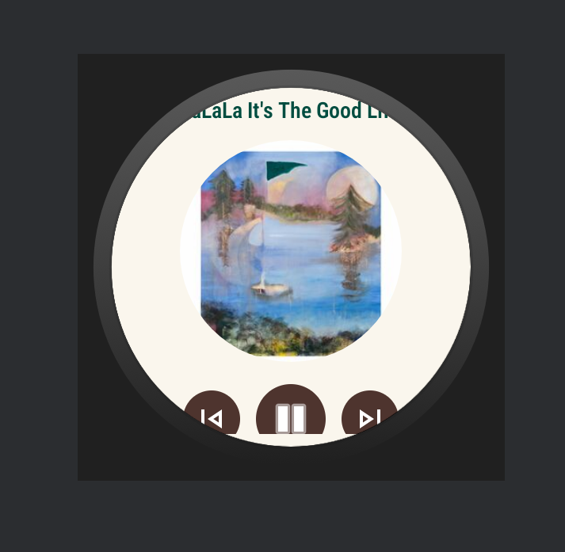
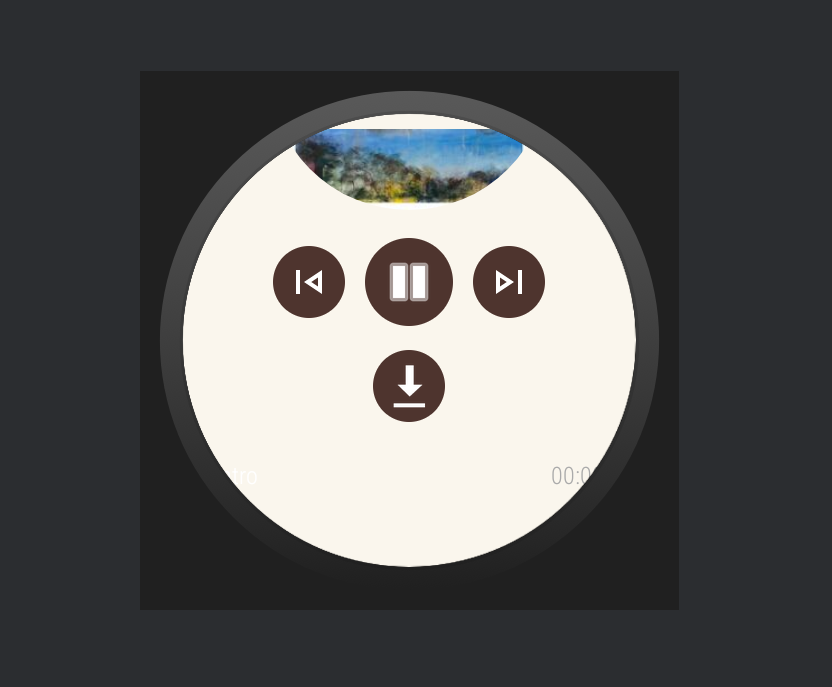
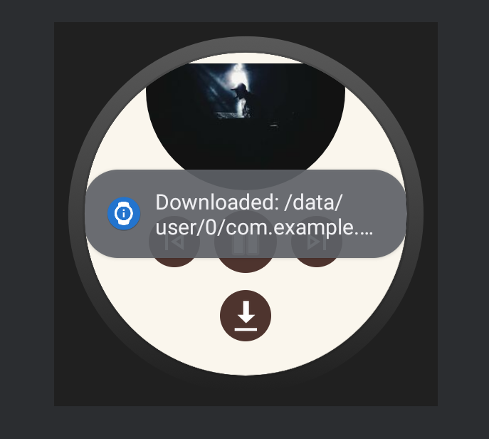

# ⌚ ChronoBooks – Wear OS Audiobook & Song Player

ChronoBooks is a modern, standalone audiobook and music player built for **Android Wear OS**,
inspired by Audible and Spotify. Using the **[Deezer Public API](https://developers.deezer.com/api)
**, it offers streaming, offline downloads, JWT-based login, and sleek smartwatch-optimized
controls — all on your wrist.


## 🎯 Key Features

| Feature             | Description                                                                 |
|---------------------|-----------------------------------------------------------------------------|
| 🔐 User Auth        | JWT-based Login & Register (via secure Node.js backend)                     |
| 📚 Audiobook List   | Search and browse songs & audiobooks using Deezer API                       |
| 🎧 Playback         | Play, Pause, Previous, Next, Resume with album art using ExoPlayer          |
| ⬇️ Offline Mode     | Download audiobooks for offline playback                                    |
| 🧠 Resume Memory    | Automatically resume the last played track and position                     |
| 🔃 Swipe Refresh    | Pull-to-refresh to fetch updated Deezer results                             |
| 🔎 Smart Search     | Live search bar for instant audiobook/song lookups                          |
| 🖼️ Album Covers     | Display cover art using Glide                                               |
| 🎛️ Spotify-style UI | Themed layout using ChronoBooks colors with intuitive buttons               |

## 📸 Screenshots

| Splash Screen | Login Screen | Register Screen |
|---------------|--------------|-----------------|
|  |  |  |

| Welcome Screen | Resume Playback | Search Results |
|----------------|-----------------|----------------|
|  |  |  |

| Now Playing | Download Option | Download Toast |
|-------------|-----------------|----------------|
|  |  |  |

## 🛠️ Tech Stack

### Frontend (Wear OS)

- **Java** – Application Logic
- **Android SDK (Wear OS)**
- **ExoPlayer** – Audio Streaming & Playback
- **Glide** – Cover Image Loading
- **Retrofit** – API Requests
- **ViewBinding** – UI Binding
- **SwipeRefreshLayout** – Dynamic List Updates

### Backend (Node.js)

- **Express.js** – API Server
- **MongoDB** – User Data & Auth Storage
- **JWT** – Token-based Auth
- **bcrypt** – Secure Password Hashing
- **CORS Enabled REST API**

## 📁 Project Structure

ChronoBooks/
├── app/
│   └── src/main/java/com/example/chronobooks/
│       ├── ui/ # Wear OS UIs (Login, Register, Player, List)
│       ├── playback/ # ExoPlayer and resume logic
│       ├── data/ # Models, DTOs (Audiobook, Chapter)
│       ├── network/ # Retrofit interfaces
│       ├── auth/ # AuthManager, JWT Storage
│       ├── utils/ # TimeUtils, ImageUtils
│       └── viewmodel/ # MVVM ViewModels
│
├── res/
│   ├── layout/ # XML Layouts
│   ├── drawable/ # Button backgrounds, icons
│   └── values/ # colors.xml, styles.xml, dimens.xml
│
├── backend/
│   ├── server.js # Express Server Entry
│   ├── routes/authRoutes.js # Login/Register Endpoints
│   ├── controllers/ # AuthController.js
│   ├── models/ # User.js
│   └── .env # JWT_SECRET, PORT

### 🔐 Backend Setup

1. Navigate to the backend directory:
   ```bash
   cd backend
   ```
2. Install dependencies:
   ```bash
   npm install
   ```
3. Create a `.env` file in the `backend` directory with the following content:
   ```env
   JWT_SECRET=your_secret_key
   PORT=8080
   ```
   **Note:** Replace `your_secret_key` with a strong, unique secret key.
4. Start the MongoDB service locally (in a separate terminal):
    ```env
   mongod --dbpath /path/to/your/mongodb/data
   ```
   **Tip:** Replace `/path/to/your/mongodb/data` with the actual data directory path.
5. Ensure MongoDB is running at:
   ```
   mongodb://localhost:27017/chronobooks
   ```
6. Start the backend server:
   ```bash
   npm start
   ```

### 📲 Frontend Setup (Android Studio)

1. Open the `ChronoBooks/app` directory in Android Studio.
2. Build and run the application on a Wear OS emulator or a physical Wear OS device.
3. Deezer content will stream via preview links.
4. Ensure the Wear OS device or emulator has an active internet connection.

## 🎨 Theme & Design

| Element         | HEX Code  |
| --------------- | --------- |
| Primary Color   | `#254D4D` |
| Accent          | `#D6A843` |
| Background      | `#F5F0E6` |
| Primary Text    | `#2A2A2A` |
| Secondary Text  | `#8A8A8A` |

**Font:** Montserrat Medium

**Design Inspiration:** The user interface is inspired by the simplicity and usability of Spotify
combined with the focused experience of audiobook players like Audible.

## ✨ Future Enhancements

- 🔉 Volume slider controls
- 🐢 Variable playback speeds
- 📖 Chapter bookmarks
- 🖼️ Offline cover caching
- 🧠 AI-powered audiobook recommendations
- 🌐 Deezer OAuth integration for a richer content experience

## 📦 Deliverables

- ✅ `ChronoBooks.apk` – Ready-to-install Wear OS application.
- ✅ `backend.zip` – Archive containing the Node.js server files.

## 🤝 Credits

- [Deezer Public API](https://developers.deezer.com/) - For providing music and audio content.
- [Android Wear OS SDK](https://developer.android.com/wear) - For building the wearable application.
- [ExoPlayer by Google](https://exoplayer.dev/) - For robust audio playback capabilities.
- [Glide image library](https://github.com/bumptech/glide) - For efficient image loading and
  caching.
- UI design inspired by [Spotify](https://www.spotify.com/) and [Audible](https://www.audible.com/).

## 📜 License

[MIT License](LICENSE) – See the `LICENSE` file for complete details.

## 🙋 Questions?

Feel free to open an issue for any questions or submit a pull request with your contributions!